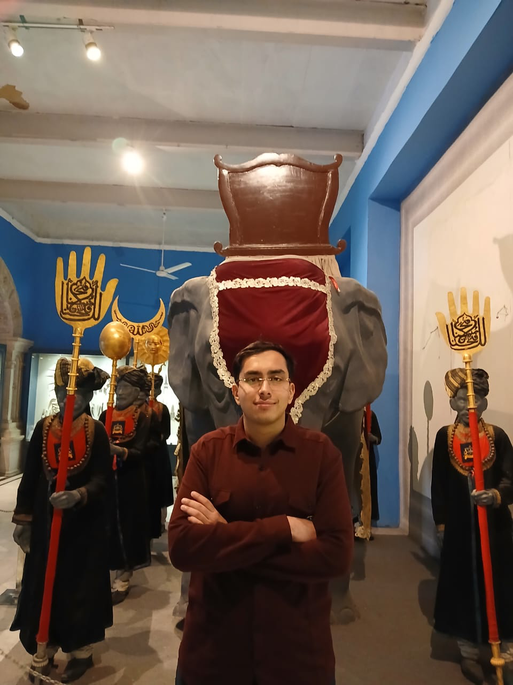

# Dhruv Charne - Full-Stack Web3 Developer &  AI Enthusiast

<!-- Profile Image -->

## Welcome to My Digital Portfolio 🌐

I'm a passionate full-stack web developer with expertise in modern web technologies, blockchain development, and artificial intelligence. This portfolio showcases my journey, skills, and contributions to the tech community.

---

## About Me

I'm **Dhruv Charne**, a dedicated full-stack developer and technology enthusiast with a strong foundation in web development, blockchain technology, and AI solutions. I am passionate about building scalable, efficient applications that solve real-world problems and contribute to the evolving digital landscape.

With a comprehensive background spanning both frontend and backend technologies, I specialize in creating seamless user experiences paired with robust server-side architectures. My expertise extends to blockchain development and AI integration, enabling me to work on cutting-edge projects that push the boundaries of modern web development.

---

## Core Expertise

### Full-Stack Web Development
- **Frontend:** React,TypeScript, Tailwind CSS, Next.js
- **Backend:** Node.js, Express.js, Python, RESTful APIs,Golang,Rust
- **Databases:** PostgreSQL, MongoDB, Redis
- **DevOps & Deployment:** Docker, GitHub Actions, AWS

### Blockchain Development
- Smart Contract Development (Solidity,Rust,Vyper)
- Web3 Integration
- DeFi & NFT Solutions
- Ethereum Ecosystem

### Artificial Intelligence
- Machine Learning Implementation
- Large Language Model (LLM) Integration
- AI-Powered Applications
- Data Analysis & Processing

---

## Education

### MITS Gwalior
**Bachelor of Technology** in Mathematics and Computing
- Rigorous coursework in Computer Science & Mathematics
- Strong foundation in algorithms, data structures, and software development
- Active participation in technical clubs and projects

---

## Certifications & Professional Development

### Cyfrin Updraft Certifications
Completed comprehensive blockchain and smart contract development courses:
- **Solidity Smart Contract Development**
- **Blockchain Basics**
- **Rust Fundamentals**
- **Introduction to Vyper and Python**
- **Foundry Fundamentals**
- **Web3 Wallet Security Basics**

These certifications represent hands-on training in production-ready blockchain development and security best practices.

---

## Key Skills

| Category | Skills |
|----------|--------|
| **Languages** | JavaScript, TypeScript, Python, Solidity, SQL,Go,Rust,Vyper |
| **Frontend** | React, Next.js, Tailwind CSS, Redux |
| **Backend** | Node.js, Express, FastAPI, Django, PostgreSQL |
| **Web3** | Ethereum, Smart Contracts, Web3.js, ethers.js |
| **AI/ML** | TensorFlow, PyTorch, OpenAI APIs, Prompt Engineering |
| **Tools & Platforms** | Git, Docker, GitHub, AWS, Firebase, Vercel |

---

## Featured Projects

*Highlight 3-5 of your best projects here. Example format:*

### Speedrun Ethereum Tokenization Challenge
**Description:** This project demonstrates a complete ERC-721 NFT Tokenization flow — from smart contract deployment on the Sepolia Testnet to an interactive Next.js + Vercel frontend for minting and viewing NFTs.
- **Tech Stack:** Nextjs,Hardhat,Solidity,Tailwind,ScaffoldETH
- **Link:** [View Project]([link-to-project](https://mynftmine.vercel.app/))

### Decentralized Staking App
**Description:** About
A beginner-friendly decentralized application (dApp) that allows users to stake ETH in a smart contract. The app coordinates a group funding effort and interacts with an external contract, demonstrating the power of Ethereum for trustless cooperation.
- **Tech Stack:** Nextjs,Hardhat,Solidity,Tailwind,ScaffoldETH
- **Link:** [View Project](https://my-staking-dapp-zeta.vercel.app/)

---

## Connect With Me

I'm always interested in collaborating on innovative projects, discussing new technologies, or exploring opportunities in full-stack development and blockchain. Feel free to reach out through any of these channels:

- **LinkedIn:** [Dhruv Charne](https://www.linkedin.com/in/dhruv-charne-908848213)
- **GitHub:** [@dhruv-charne](https://github.com/DHRUVCHARNE)
- **X (Twitter):** [@dhruv-charne](https://x.com/Dhruv4ne)
- **SpeedrunEthereum:** [Profile](https://speedrunethereum.com/builders/0x337c6Cc82221266B951f773E1AbD81eA0354ff25)
- **Email:** [your-email@example.com](mailto:dhruv4ne@gmail.com)

---

### Stats
- **GitHub Contributions:** 57 in the last year
- **Projects Completed:** 15
- **Certifications Earned:** 16

---

## My Philosophy

I believe in:
- **Continuous Learning:** Technology evolves rapidly, and I stay updated with the latest trends and best practices
- **Clean Code:** Writing maintainable, readable, and well-documented code
- **User-Centric Design:** Building applications that are intuitive and enjoyable to use
- **Open Source Contribution:** Giving back to the community and collaborating with developers worldwide
- **Innovation:** Leveraging emerging technologies like blockchain and AI to create unique solutions

---

## Get in Touch

Whether you're looking to collaborate, have a project in mind, or just want to chat about web development and technology, I'd love to hear from you!

**📧 Email:** dhruv4ne@gmail.com  
**💼 LinkedIn:** [Connect with me](https://www.linkedin.com/in/dhruv-charne-908848213)  
**🐙 GitHub:** [Follow my work](https://github.com/DHRUVCHARNE)  
**𝕏 Twitter:** [Stay updated](https://x.com/Dhruv4ne)

---

## License

This portfolio is open source and available under the MIT License. Feel free to fork and use it as a template for your own portfolio!

---

### Made with ❤️ by Dhruv Charne

*Last Updated: November 2025*

